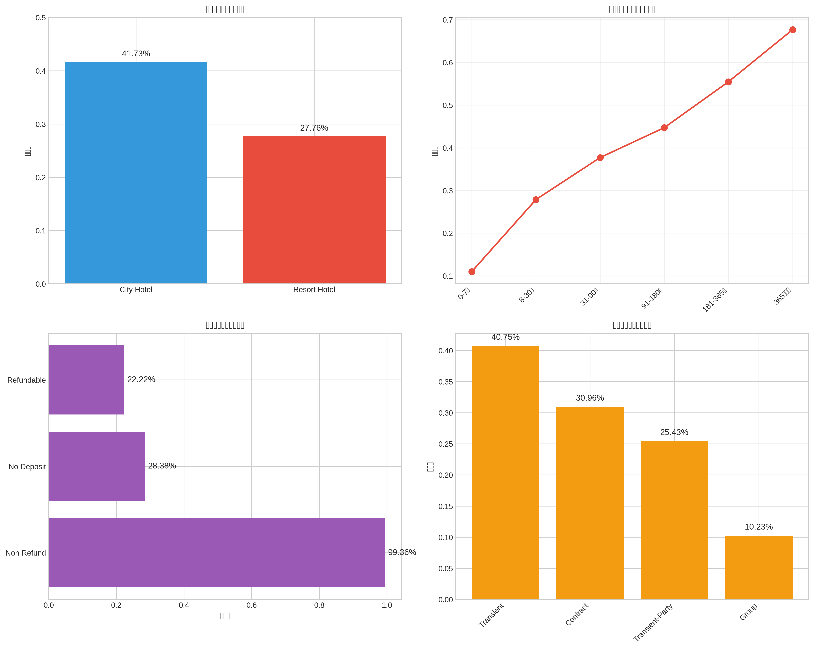
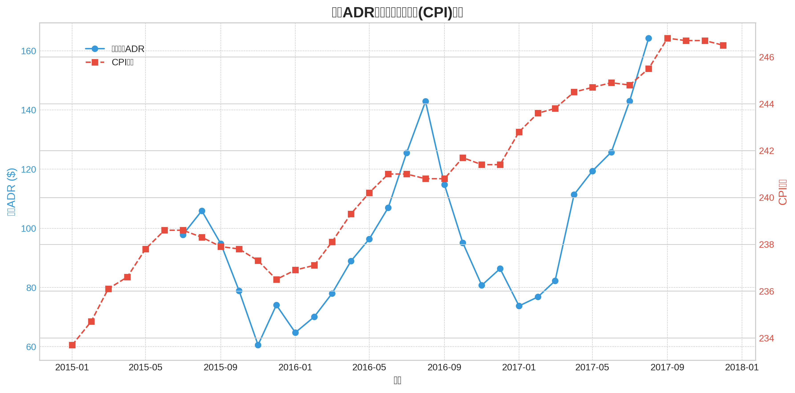

# Hotel Booking Analysis - Marketing Analytics Project

## 项目概述

本项目是针对酒店预订数据的全面探索性数据分析（EDA），旨在理解客户预订行为、识别关键业务模式，并提出具有商业价值的营销问题。项目涵盖了数据清洗、变量探索、可视化分析以及公共数据集的整合。

## 项目结构

```
hotel_booking_analysis/
├── README.md                          # 项目说明文档
├── data/                              # 原始数据
│   └── hotel_bookings.csv            # 酒店预订数据集（119,390条记录）
├── public_data/                       # 公共数据集
│   ├── README.md                     # 公共数据集说明
│   ├── cpi_data.csv                  # 美国CPI数据（2015-2017）
│   ├── portugal_tourism.csv          # 葡萄牙旅游统计
│   ├── europe_tourism.csv            # 欧洲旅游趋势
│   └── seasonal_index.csv            # 旅游季节性指数
├── analysis/                          # 分析脚本和结果
│   ├── hotel_analysis.py             # 主要分析脚本
│   ├── download_public_data.py       # 公共数据下载脚本
│   ├── hotel_type_stats.csv          # 按酒店类型统计
│   ├── monthly_stats.csv             # 月度统计
│   └── market_segment_stats.csv      # 市场细分统计
├── visualizations/                    # 可视化图表
│   ├── cancellation_analysis.png     # 取消率分析
│   ├── revenue_analysis.png          # 收入(ADR)分析
│   ├── booking_patterns.png          # 预订模式分析
│   ├── customer_source_analysis.png  # 客户来源分析
│   ├── adr_vs_cpi.png               # ADR vs CPI对比
│   └── bookings_vs_seasonal_index.png # 预订量vs季节性指数
└── reports/                           # 分析报告
    ├── Mktg2505_Group_project_part1_completed.Rmd  # R Markdown报告
    └── final_report.md               # 最终分析报告
```

## 数据集说明

### 主数据集：hotel_bookings.csv

- **记录数**: 119,390条预订记录
- **时间跨度**: 2015-2017年
- **酒店类型**: City Hotel（城市酒店）和 Resort Hotel（度假酒店）
- **变量数**: 32个变量，包括预订信息、客户信息、房间信息等

### 公共数据集

为了提供更宏观的视角，我们整合了以下公共数据集：

1. **CPI数据** - 来自FRED，用于评估价格变化与通胀的关系
2. **葡萄牙旅游统计** - 来自INE，用于验证本地市场趋势
3. **欧洲旅游趋势** - 来自Eurostat，用于行业基准比较
4. **季节性指数** - 标准旅游季节性模式

## 关键发现

### 核心指标

| 指标 | 数值 |
|------|------|
| 总体取消率 | 37.04% |
| 回头客比例 | 3.19% |
| 平均提前预订天数 | 104天 |
| 平均住宿时长 | 3.4晚 |
| 平均ADR | $101.83 |

### 主要洞察

1. **高取消率问题**: City Hotel取消率高达41.7%，提前期越长取消率越高
2. **低客户忠诚度**: 仅3.19%的回头客比例，客户保留是关键挑战
3. **强季节性**: 夏季（8月）为旺季，ADR和预订量均达峰值
4. **渠道依赖**: 超过80%预订来自旅行社/旅游运营商
5. **欧洲市场主导**: 客户主要来自葡萄牙、英国、法国

## 三个核心营销问题

### 问题1: 如何降低高取消率？

**重点**: 针对City Hotel和长期预订实施差异化押金策略，提供灵活改期选项

### 问题2: 如何提升客户忠诚度？

**重点**: 建立结构化忠诚度计划，通过个性化营销和优质服务提高回头客比例

### 问题3: 如何优化定价和渠道策略？

**重点**: 实施动态定价，开发淡季套餐产品，加强直接预订渠道建设

## 使用方法

### 环境要求

**Python环境**:
```bash
pip install pandas numpy matplotlib seaborn
```

**R环境** (用于生成R Markdown报告):
```bash
install.packages(c("rmarkdown", "tidyverse", "janitor", "knitr"))
```

### 运行分析

1. **数据分析**:
```bash
cd analysis
python3 hotel_analysis.py
```

2. **下载公共数据**:
```bash
python3 download_public_data.py
```

3. **生成R Markdown报告**:
```R
rmarkdown::render("reports/Mktg2505_Group_project_part1_completed.Rmd")
```

## 可视化示例

### 取消率分析


### ADR vs CPI对比


## 数据来源

- **主数据集**: Hotel Booking Demand Dataset
- **CPI数据**: [FRED - Federal Reserve Economic Data](https://fred.stlouisfed.org/)
- **葡萄牙旅游统计**: [INE Portugal](https://www.ine.pt/)
- **欧洲旅游统计**: [Eurostat](https://ec.europa.eu/eurostat/)

## 作者

Manus AI

## 许可证

本项目仅用于学术研究和教育目的。

## 更新日志

- **2026-02-02**: 初始版本发布
  - 完成探索性数据分析
  - 整合公共数据集
  - 生成可视化图表
  - 提出三个核心营销问题
